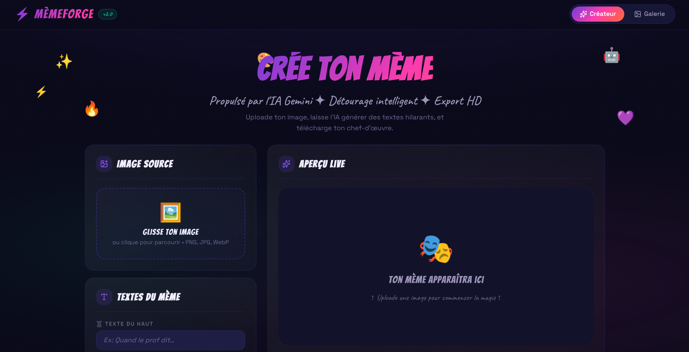

# ⚡ MèmeForge v2.0 — Générateur de Mèmes Intelligent & Cloud Native

MèmeForge est une application web moderne (Full-Stack) dédiée à la création, la personnalisation et à l'archivage de mèmes. Développée dans le cadre du processus d'admission pour **SUPINFO**, cette plateforme transcende le cahier des charges initial en fusionnant une expérience utilisateur hautement interactive avec des technologies de pointe en Intelligence Artificielle (Vision par ordinateur) et une architecture Cloud robuste sur **Amazon Web Services (AWS)**.



---

## 🚀 Guide d'Utilisation Fonctionnel

L'application est structurée autour d'une interface à deux volets (Créateur et Galerie) accessible de manière fluide sans rechargement de page.

### 1. Création d'un Mème (Le Générateur)
* **Importation de l'image :** Vous pouvez téléverser n'importe quelle image au format standard (PNG, JPG, JPEG) soit en la glissant-déposant directement dans la zone dédiée (*Drag & Drop*), soit en cliquant sur le bouton d'importation pour ouvrir le sélecteur de fichiers.
* **Édition des textes :** Deux champs de saisie distincts vous permettent d'ajouter un texte sur la partie supérieure (*Top Text*) et la partie inférieure (*Bottom Text*) de l'image. 
* **Aperçu en temps réel :** Chaque lettre saisie s'affiche instantanément sur l'image avec la typographie d'impact classique des mèmes (blanche avec un contour noir prononcé), vous permettant de cadrer parfaitement votre punchline avant toute sauvegarde.
* **Génération par IA (Bouton "Gemini réfléchit") :** Si vous manquez d'inspiration, cliquez sur l'icône de baguette magique. L'API va transmettre votre image au modèle multimodal **Gemini 2.5** qui analysera le contexte visuel (objets, expressions, ambiance) pour vous proposer automatiquement des propositions de textes humoristiques.
* **Détourage Intelligent (Bouton "Détourer") :** En cliquant sur l'icône de ciseaux, le backend utilise le modèle de deep learning **U2Net (Rembg)** pour analyser les contrastes et détourer instantanément l'image en supprimant l'arrière-plan, laissant le sujet principal sur fond transparent.
* **Téléchargement & Sauvegarde :** * Le bouton **Télécharger** compile instantanément l'image et ses calques de texte en un fichier PNG haute définition disponible immédiatement sur votre appareil.
  * Le bouton **Sauvegarder** envoie le mème finalisé vers le serveur pour l'immortaliser dans la galerie publique.

### 2. Consultation de l'Historique (La Galerie)
* Cliquez sur l'onglet **Galerie** dans la barre de navigation supérieure pour consulter l'ensemble des mèmes créés par la communauté.
* **Rafraîchissement dynamique :** Un bouton de rechargement permet de requêter à nouveau l'API sans rafraîchir la page web.
* **Mode Lightbox :** En cliquant sur une image de la galerie, une fenêtre modale animée s'ouvre au premier plan pour afficher le mème en haute résolution.

---

## 🛠️ Stack Technique & Architecture Logicielle

L'application applique un découplage strict entre la couche de présentation et la couche logique.

### 1. Frontend (Interface Graphique)
* **Framework :** `React 18` initié avec le moteur d'assemblage ultra-rapide `Vite`.
* **Animations :** `framer-motion` orchestre toutes les transitions d'onglets, l'apparition des Toasts (notifications) et l'ouverture de la Lightbox pour une sensation d'application native.
* **Gestion Réseau :** L'ensemble des requêtes HTTP vers le cloud est géré par `axios`, isolé dans un module `api.js` pour centraliser l'URL de production.

### 2. Backend (API RESTful)
* **Framework :** `FastAPI` (Python 3.11), sélectionné pour ses performances asynchrones élevées (standard ASGI) et sa documentation interactive générée automatiquement (Swagger accessible via `/docs`).
* **Moteurs d'Inférence IA :**
  * `google-genai` : Pour l'envoi sécurisé des payloads d'images à l'infrastructure d'IA multimodale de Google.
  * `rembg` & `onnxruntime` : Pour exécuter le modèle de détourage directement sur le CPU du serveur sans dépendance externe.
* **Persistance :** Le driver `psycopg2` assure l'interface entre le code Python et la base de données relationnelle.

---

## ☁️ Infrastructure Cloud & Déploiement (DevOps AWS)

Le déploiement de MèmeForge repose sur une architecture Cloud industrielle, sécurisée et reproductible.

```
[ Navigateur Client ] 
        │ (Trafic public HTTP - Port 80)
        ▼
┌────────────────── Instance AWS EC2 (Ubuntu Server) ──────────────────┐
│                                                                      │
│   ┌─────────────── Serveur Web Nginx (Reverse Proxy) ────────────┐   │
│   │                                                              │   │
│   │  /        ──> Sert les fichiers statiques (React Build)      │   │
│   │  /memes   ──> Redirige en local vers le Port 8000 (API)      │   │
│   │                                                              │   │
│   └──────────────────────────────┬───────────────────────────────┘   │
│                                  │ (Flux Localhost - 127.0.0.1)      │
│                                  ▼                                   │
│   ┌─────────────────── Service Démon Systemd ────────────────────┐   │
│   │                                                              │   │
│   │  Uvicorn (FastAPI Application) ──> Lit/Écrit dans /uploads   │   │
│   │                                                              │   │
│   └──────────────────────────────┬───────────────────────────────┘   │
│                                  │                                   │
└──────────────────────────────────┼───────────────────────────────────┘
                                   │ (Flux Privé PostgreSQL - Port 5432)
                                   ▼
              ┌────────────────────────────────────────┐
              │   Base de Données Managée Amazon RDS   │
              │         (Moteur PostgreSQL 15)         │
              └────────────────────────────────────────┘
```

### 1. Infrastructure as Code (IaC) avec Terraform
Le fichier `main.tf` définit l'ensemble des ressources nécessaires au projet chez le fournisseur AWS (Région `eu-west-3` à Paris) :
* **Groupes de Sécurité (Security Groups) :** Des règles de pare-feu strictes isolent les composants. L'instance EC2 accepte le SSH (port 22) pour l'administration et le HTTP (port 80) pour les utilisateurs. 
* **Amazon RDS (Relational Database Service) :** La base de données PostgreSQL est isolée au sein d'un sous-réseau privé. Elle est totalement invisible depuis l'Internet public et accepte uniquement les connexions entrantes issues du groupe de sécurité de notre serveur EC2 (port 5432).

### 2. Serveur Web & Reverse Proxy Nginx
Plutôt que d'exposer directement les runtimes applicatifs sur internet, **Nginx** agit comme le point d'entrée unique de l'instance EC2. Sa configuration hybride gère de front deux typologies de flux :
* **Distribution Statique (Frontend) :** Pour toute requête vers la racine `/`, Nginx distribue les fichiers HTML, CSS et JavaScript compilés du dossier `/var/www/meme-frontend`.
* **Routage Dynamique (Backend) :** Toutes les requêtes ciblant les endpoints de l'application (`/memes`, `/ai`, `/uploads`, `/docs`) sont interceptées par Nginx et transmises de manière étanche au serveur d'application local.

### 3. Gestion de Processus avec un Service Systemd Linux
Afin d'éviter l'interruption de l'API lors de la déconnexion de la session SSH, le serveur Uvicorn est enregistré comme un démon du système d'exploitation via un fichier d'unité `systemd` (`/etc/systemd/system/meme-api.service`). 
Ce service écoute sur `127.0.0.1:8000`, assurant ainsi que l'API reste confinée à l'intérieur de la machine et n'échange qu'avec Nginx, optimisant drastiquement la sécurité globale du serveur.

---

## 📝 Informations Académiques
* **Auteur :** Junior Stéphane Céleste Nguetsa
* **Spécialité :** Réseaux et Sécurité Informatique (Bachelor 3)
* **Institution :** SUPINFO (Mini-projet d'admission)
* **Date de Déploiement :** Mai 2026
* **Lien vers l'appllication :** http://noxmeme.duckdns.org/
* **Lien vers le dépot Github :** https://github.com/NOX-Theteenager/MemeForge-nox